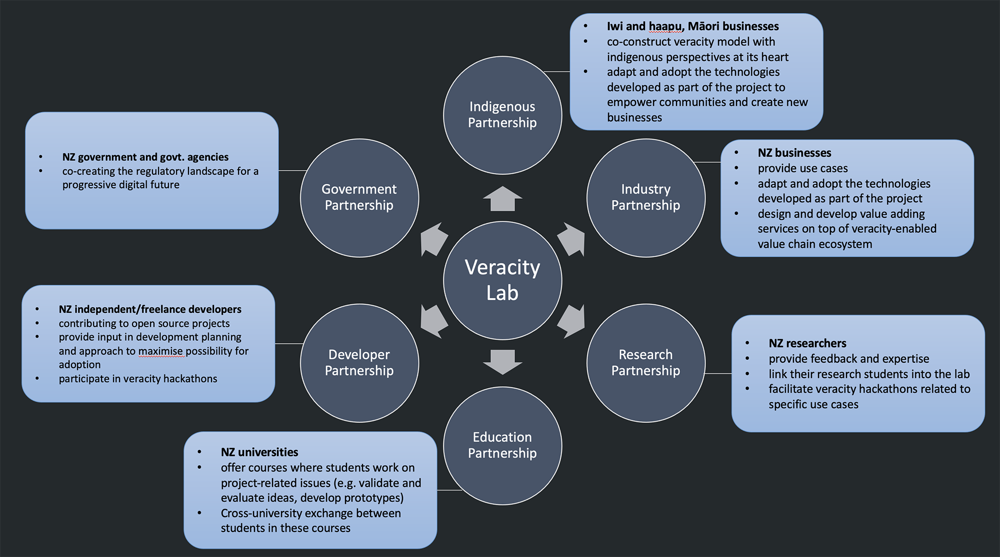
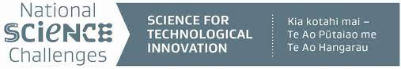
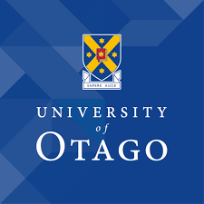
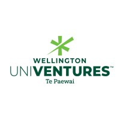
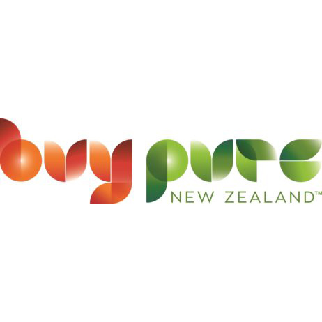

Est. July 2021

<html>
<iframe width="560" height="315" src="https://www.youtube.com/embed/VahekMWDx2g" title="The Veracity Lab" frameborder="0" allow="accelerometer; autoplay; clipboard-write; encrypted-media; gyroscope; picture-in-picture" allowfullscreen></iframe>
</html>

<section>
	<h3 class="major">Vision</h3>
    
 Our vision is to create a <strong>high veracity digital nation</strong> that reflects and amplifies a desired quality of life here in Aotearoa New Zealand 

    <!-- 
 -->
</section>

<section>
	<h3 class="major">Purpose</h3>
    
 Veracity Lab facilitates deep and inclusive conversations across all 
areas of society about our digital future, and provides capabilities to 
incubate and undertake research and development work at the bleeding 
edge of values-based and human-centered technology.  

		
</section>

<section>
<h3 class="major">Partnership model </h3> 

Veracity lab will provide the objective and safe environment to 
facilitate the following partnerships: 

<ul>
	<li> Indigenous </li>
	<li> Industry </li>
	<li> Research </li>
	<li> Education </li>
	<li> Developer </li>
	<li> Government </li>
</ul>
</section>

<section>
	<h3 class="major">People</h3>
	<b>Leadership</b>
	<ul>
			<li>Co-director: Associate Professor Markus Luczak-Roesch - Victoria University of Wellington</li>
			<li>Co-director: Associate Prof Māui Hudson (Te Whakatohea, Ngā Ruahine, Te Mahurehure) - University of Waikato</li>
			<li>Associate Director: Brendan Hoare - Buy Pure New Zealand</li>
	</ul>
	<b>Research Team</b>
			<ul>
			<li>Dr Kelly Blincoe - University of Auckland</li>
			<li>Tim Miller - Victoria University of Wellington</li>
			<li>Professor Steve Reeves - University of Waikato</li>
			<li>Associate Professor Jens Dietrich - Victoria University of Wellington</li>
			<li>Associate Professor David Eyers - University of Otago</li>
			<li>Kevin Shedlock - Victoria University of Wellington</li>
			<li>Associate Professor Matthias Galster - University of Canterbury</li>
			<li>Professor Stephen Cranefield - University of Otago</li>
			</ul>
			
	<b>Operational and Management</b>
			<ul>
			<li>Commercialisation Advisor: Hamish Findlay - Wellington UniVentures</li>
			<li>Project Coordinator and Research Assistant: Jane Li - Victoria University of Wellington </li>
			</ul>

	<b>Advisory Board</b>
    		

			<ul>
			<li>Karyne Rogers - Senior Scientist at GNS Science (Lower Hutt, NZ)</li>
			<li>James Noble - Professor of Computer Science and Software Engineering, Victoria University of Wellington</li>
			<li>Ben Tairea  - Managing Director and Kaiwhakahaere, CEO of Āhau </li>
			<li>Richman Wee  - Academic Research Manager for the New Zealand Law Foundation (NZLF), Faculty of Law, University of Waikato </li>
			</ul>
			
		

</section>

<section> 
	<h3 class="major">Supported by </h3> 
</section>

<!-- 
<section> 
	<h3 class="major">Founding Partners </h3> 
</section>

 -->

